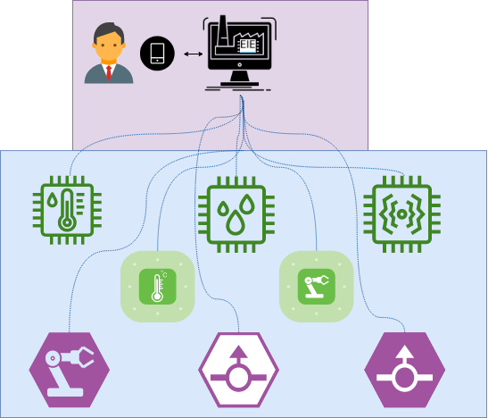

**************************************************
Laboratorio 1: Documentación de diseño de software
**************************************************

Requisitos previos
==================
* Siga las instrucciones de `Primeros pasos <../../getting-started.html>`_ para preparar el ambiente base del curso.
* Asegurarse de tener una cuenta activa en `GitHub <https://github.com/>`_ y `Read the Docs <https://readthedocs.org/>`_. Para `Read the Docs` puede registrarse con la misma cuenta de GitHub.
* Hacer un fork personal del repositorio `ie0417-dev <https://github.com/ezamoraa/ie0417-dev>`_. Este repositorio tiene el mismo ambiente base que `ie0417 <https://github.com/ezamoraa/ie0417>`_ pero sin las presentaciones ni enunciados del curso. Para esto puede utilizar el botón `Fork` que se encuentra en el sitio del repositorio. Para más detalles sobre este proceso puede consultar la siguiente `guía de forking <https://docs.github.com/en/get-started/quickstart/fork-a-repo>`_.
* Clone su repositorio del fork, este lo utilizará a lo largo del curso para presentar sus laboratorios y proyectos. De ser necesario, posteriormente podrá hacer rebase del repositorio original `ie0417-dev <https://github.com/ezamoraa/ie0417-dev>`_ agregándolo como `remote` en Git.
* Importar el proyecto de su repositorio del fork en `Read the Docs`. A la hora de asignar el nombre del proyecto en `Read the Docs` utilice el formato ``ie0417-dev-<carné UCR>`` para evitar conflictos de dominio, por ejemplo ``ie0417-dev-b47769``. Para más detalles puede consultar el siguiente `tutorial de Read the Docs <https://docs.readthedocs.io/en/stable/tutorial/>`_.

Introducción
============

El objetivo de este laboratorio consiste en diseñar el software de un administrador de dispositivos interconectados en la red de una fábrica y documentarlo. Imagine un ambiente industrial de `Internet of Things` (IoT) como el siguiente:

La fábrica necesita un software centralizado que pueda enviar comandos de control y status a los diferentes computadores conectados a las máquinas. La start-up `eieLabs`, en la cual Usted trabaja como arquitecto y desarrollador principal, fue contratada para implementar este software.

Después de una reunión de `brainstorming` con los gerentes e ingenieros de la fábrica, se acordó que la solución debe tener al menos dos partes: ``eieManager`` y ``eieDevice``. En esta reunión se creó siguiente bosquejo inicial del sistema:

.. image:: img/eie_manager.png
   :align: center

De este diagrama es importante notar que ``Client`` es un componente externo al sistema, y que se deben utilizar protocolos de comunicación tanto entre ``Client`` y ``eieManager``, como entre ``eieManager`` y las instancias de ``eieDevice``, ya que estos corren en diferentes computadoras. Por ejemplo, ``eieManager`` se ejecuta en un servidor de la empresa y ``eieDevice`` en los diferentes dispositivos. Todos los sistemas involucrados ejecutan alguna distribución de Linux.

Al consultar más detalles sobre la funcionalidad del sistema, se determinó que:

* ``eieManager`` debe exponer un `Application Programming Interface (API) <https://www.mulesoft.com/resources/api/what-is-an-api>`_ para controlar los dispositivos de la fábrica desde ``Client``.

* Los dispositivos pueden generar respuestas a los comandos que se deben entregar de vuelta al cliente.

* Los comandos deben estar predefinidos y se pueden identificar con un nombre. Puede que ciertos dispositivos solo soporten algunos comandos.

* Los comandos pueden ser dirigidos tanto a un dispositivo en específico como a un grupo de `broadcast`. Todos los dispositivos en el grupo de `broadcast` deberán recibir el mismo comando.

* Al enviar comandos a un grupo de `broadcast`, ``eieManager`` debe recibir todas las respuestas de los distintos dispositivos para formar la respuesta final que se entrega a ``Client``.

Por otra parte, en reuniones posteriores con los `stakeholders` de la fábrica, se identificaron los siguientes objetivos de negocio que debe cumplir el sistema para mantener una ventaja competitiva:

+------------------------------------------------------------------------------+------------+
| Objetivo de negocio                                                          |  Prioridad |
+==============================================================================+============+
| | Que el API pueda ser fácilmente consumido por otro equipo de desarrollo    | Alta       |
| | para implementar un cliente en un App móvil con GUI. No se puede asumir    |            |
| | que este cliente va a utilizar algún lenguaje en específico.               |            |
+------------------------------------------------------------------------------+------------+
| | Soportar dispositivos heterogéneos, de distintos fabricantes y/o           | Alta       |
| | características. Nuevos dispositivos deben ser sencillos de agregar y      |            |
| | esto no debe implicar cambios en el API. Además, ciertos dispositivos y    |            |
| | casos de uso podrían requerir nuevos protocolos de comunicación.           |            |
+------------------------------------------------------------------------------+------------+
| | Que el sistema sea capaz de generar una amplia variedad de comandos.       | Alta       |
| | Nuevos comandos deben ser sencillos de agregar y esto no debe implicar     |            |
| | cambios en el API.                                                         |            |
+------------------------------------------------------------------------------+------------+
| | Que el sistema tenga un rendimiento y escalabilidad adecuada al operar con | Media      |
| | los dispositivos, tal que se soporte el envío de comandos a múltiples      |            |
| | dispositivos simultáneamente en los casos de `broadcast`.                  |            |
+------------------------------------------------------------------------------+------------+
| | Que el sistema tenga alta disponibilidad, siendo capaz de volver a su      | Media      |
| | operación normal luego de un fallo que genere un cierre del proceso de     |            |
| | ``eieManager``, recuperando su estado original.                            |            |
+------------------------------------------------------------------------------+------------+

Consideraciones
---------------

Luego de varios días de reuniones y de meditar sobre el problema, un `sueño lúcido` le reveló las
siguientes consideraciones (se recomienda mantener esta `revelación divina` en secreto y aplicarla a discreción):

* Los objetivos de negocio del sistema están relacionados mayoritariamente con `modificabilidad <https://mv1.mediacionvirtual.ucr.ac.cr/pluginfile.php/2129314/mod_folder/content/0/modifiability_tactics-and-patterns.pdf?forcedownload=1>`_, aunque también son relevantes el rendimiento y la disponibilidad.

* Una táctica importante para el rendimiento es la `concurrencia <https://web.mit.edu/6.005/www/fa14/classes/17-concurrency/>`_.

* Los comandos podrían consistir del nombre de comando, un `target` y una lista de argumentos: ``(command, target, arg1=val1, ..., argN=valN)``

* Si bien el protocolo de comunicación para comandos entre ``eieManager`` y ``eieDevice`` debe ser abstraido para facilitar la integración de nuevos casos de uso, podemos definir un protocolo inicial basado en `remote procedure calls (RPCs) <https://www.geeksforgeeks.org/remote-procedure-call-rpc-in-operating-system/>`_.

* El principio de diseño de separación de responsabilidades es crucial para el proceso de `Attribute-Driven Design` (ADD). En el caso de ``eieManager``, se pueden definir componentes que se encarguen de distintas responsabilidades, tales como:

  * ``ConfigHandler`` Configuración a partir de un archivo. Este puede incluir la lista de dispositivos soportados con su respectiva información (nombre, grupo broadcast, datos de conexión, etc).
  * ``APIServer`` Servicio de solicitudes del cliente.
  * ``CommandRegistry`` Registro de los comandos soportados y su información.
  * ``DeviceManager`` Administración del ciclo de vida de los dispositivos.
  * ``GroupManager`` Resolución de dispositivos pertenecientes a grupos `broadcast`.
  * ``CommandInvoker`` Controla la ejecución de los comandos solicitados por el cliente.
  * ``TransportClient`` Abstrae el protocolo de comunicación para interactuar con el dispositivo. Un derivado de este componente puede ser ``RPCClient``
  * ``DatabaseHandler`` `Wrapper` de una base de datos para almacenar configuración y estado.
  * Otros objetos relevantes para el diseño podrían ser ``Device``, ``Group`` y ``CommandInfo``.

* En el caso de ``eieDevice``, se pueden definir componentes tales como:

  * ``TransportServer`` Responde a solicitudes de comandos provenientes del ``TransportClient``.
  * ``CommandManager`` Registro y ejecución de los comandos soportados por el dispositivo.
  * ``Command`` Implementa la funcionalidad del comando.

* `Tomar mucho café para diseñar software no es bueno para la salud, pero hay que disfrutar la vida...`

Instrucciones
=============
A continuación se describirán las instrucciones de los apartados de este laboratorio.

Planeamiento
------------

* De manera breve, explique cómo se pueden planear los `releases` de funcionalidad del proyecto para habilitar lo más rápido posible el desarrollo en el equipo del App (externo a `eieLabs`).

  * Utilice conceptos de planeamiento a largo plazo con metodologías Agile (Quiz 2).

Requerimientos
--------------

* Especifique una lista de requerimientos funcionales y no funcionales detallados según el apartado `5.3 Specific Requirements` del estándar `IEEE Recommended Practice for Software Requirements Specifications (Std 830-1998) <https://mv1.mediacionvirtual.ucr.ac.cr/mod/resource/view.php?id=1613826>`_.

  * Asegúrese de utilizar identificadores numéricos para todos los requerimientos (ej, ``REQ-XYZ``).

Attribute-driven Design (ADD)
-----------------------------

* Aplique la metodología de `Attribute-Driven Design` (ADD) para el diseño del sistema

  * Siga los pasos presentados en clase y utilice como referencia los papers `Attribute-Driven Design <https://mv1.mediacionvirtual.ucr.ac.cr/pluginfile.php/2129314/mod_folder/content/0/Attribute-Driven%20Design%20%28ADD%29%2C%20Version%202.0.pdf?forcedownload=1>`_ y `How Business Goals Drive Architectural Design <https://mv1.mediacionvirtual.ucr.ac.cr/pluginfile.php/2129314/mod_folder/content/0/how-business-goals-drive-architectural-design.pdf?forcedownload=1>`_.
  * Asegúrese de justificar y priorizar al menos dos atributos de calidad relevantes para el diseño a partir de los objetivos de negocio.
  * Se requiere al menos una iteración del proceso para cada parte del sistema (``eieManager`` y ``eieDevice``.
  * Asegúrese de describir cómo los subsistemas o componentes diseñados cumplen con los atributos de calidad haciendo referencia a tácticas y/o patrones de diseño. Se sugiere utilizar las consideraciones presentadas en la introducción.

Patrones de diseño
------------------

* Explique cómo se puede aplicar el patrón de diseño `Proxy <https://en.wikipedia.org/wiki/Proxy_pattern>`_ para abstraer la interacción y comunicación con los dispositivos desde ``eieManager``.

  * Dentro de los componentes sugeridos en la introducción, a cuáles se les puede relacionar con este patrón?

* Explique cómo se puede aplicar el patrón de diseño `Command <https://en.wikipedia.org/wiki/Command_pattern>`_ para desacoplar los procesos de:

  * Encapsular la información requerida para ejecutar comandos en dispositivos específicos.
  * Ejecutar los comandos y esperar la respuesta correspondiente.

Diagramas UML
-------------
* Implemente los diagrama de clases de los componentes de ``eieManager`` y ``eieDevice``.

  * Asegúrese de representar relaciones de uso, composición y generalización entre los diferentes subsistemas y objetos. La generalización es especialmente importante para representar el polimorfismo necesario al tener que soportar diferentes dispositivos (``Device``), protocolos de transporte (``TransportClient``) y comandos (``Command``), de manera genérica.
  * No describa de forma detallada los atributos ni los métodos de las clases. Sí incluya los nombres de algunos métodos relevantes para la interacción entre los subsistemas.

* Implemente diagramas de secuencia que muestren la interacción completa entre los subsistemas de ``eieManager`` y ``eieDevice`` para los siguientes escenarios:

  * El cliente envía un comando a un dispositivo específico.
  * El cliente envía un comando a un grupo de broadcast.

.. note::

   Para la realización de estos diagramas se debe utilizar la extensión de `PlantUML` para Sphinx. Esta extensión ya está instalada en el ambiente base. Por ejemplo:

.. uml::

   @startuml

   title Relationships - Class Diagram

   class Dwelling {
     +Int Windows
     +void LockTheDoor()
   }

   class Apartment
   class House
   class Commune
   class Window
   class Door

   Dwelling <|-down- Apartment: Inheritance
   Dwelling <|-down- Commune: Inheritance
   Dwelling <|-down- House: Inheritance
   Dwelling "1" *-up- "many" Window: Composition
   Dwelling "1" *-up- "many" Door: Composition

   @enduml

.. uml::

  @startuml
  Alice -> Bob: Authentication Request

  alt successful case

      Bob -> Alice: Authentication Accepted

  else some kind of failure

      Bob -> Alice: Authentication Failure
      group My own label
      Alice -> Log : Log attack start
          loop 1000 times
              Alice -> Bob: DNS Attack
          end
      Alice -> Log : Log attack end
      end

  else Another type of failure

    Bob -> Alice: Please repeat

  end
  @enduml

Evaluación
==========
Este laboratorio se realizará preferiblemente en grupos de 2 o 3 personas.

.. tip::

   A pesar de distribuir la documentación entre los miembros del grupo, asegúrese de discutir el diseño y que todos los miembros entiendan los diferentes apartados. Esto es importante para su formación.

Rúbrica
-------

+--------------------+------------------------------------------------------------+------------+
| Apartado           |  Criterios de evaluación                                   | Porcentaje |
+====================+============================================================+============+
| Planeamiento       || Aplicar los conceptos de Agile y estrategias para         | 10%        |
|                    || planeamiento a largo plazo con múltiples equipos.         |            |
+--------------------+------------------------------------------------------------+------------+
| Requerimientos     || Aplicar las buenas prácticas de especificación            | 15%        |
|                    || de requerimientos específicos según IEEE Std 830.         |            |
+--------------------+------------------------------------------------------------+------------+
| ADD                || Aplicar la secuencia de pasos de ADD y justificar         | 30%        |
|                    || correctamente las decisiones de diseño.                   |            |
+--------------------+------------------------------------------------------------+------------+
| Patrones de diseño || Justificar correctamente la aplicabilidad de los patrones | 15%        |
|                    || indicados, relacionando conceptos de diseño con los       |            |
|                    || componentes relevantes.                                   |            |
+--------------------+------------------------------------------------------------+------------+
| Diagramas UML      || Crear los diagramas de clases y secuencia utilizando      | 30%        |
|                    || PlantUML directamente en Sphinx con reST.                 |            |
|                    || Implementar mínimo 2 diagramas de clases (``eieManager``, |            |
|                    || ``eieDevice``) y 2 diagramas de secuencia (`device cmd`,  |            |
|                    || `group cmd`).                                             |            |
+--------------------+------------------------------------------------------------+------------+

Revisión
--------

* Se debe demostrar con base en los autores de los commits de Git que todos los miembros del grupo trabajaron colaborativamente en el laboratorio utilizando control de versiones. De no ser así, no se asignará puntaje a los miembros que no contribuyeron (a menos que se justifique una excepción).
* Se utilizará la fecha del último commit de `merge` de un Pull Request (PR) de GitHub que modifique la documentación del laboratorio respectivo para determinar si la entrega se realizó a tiempo.
* Si se realizan entregas tardías, se rebajará 10% acumulativo por cada día extra (-10% primer día, -20% segundo día, etc).
* Se revisará la página de documentación de `Read the Docs` indicada en la tarea de Mediación Virtual del laboratorio.
* Para los grupos, sólo es necesario subir los cambios en el repositorio de uno de los miembros. Los demás miembros pueden hacer referencia a dicho repositorio y/o sincronizar los cambios en sus repositorios correspondientes.
