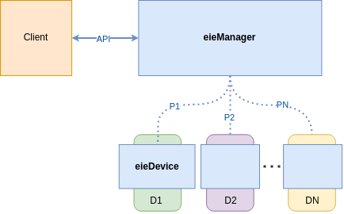
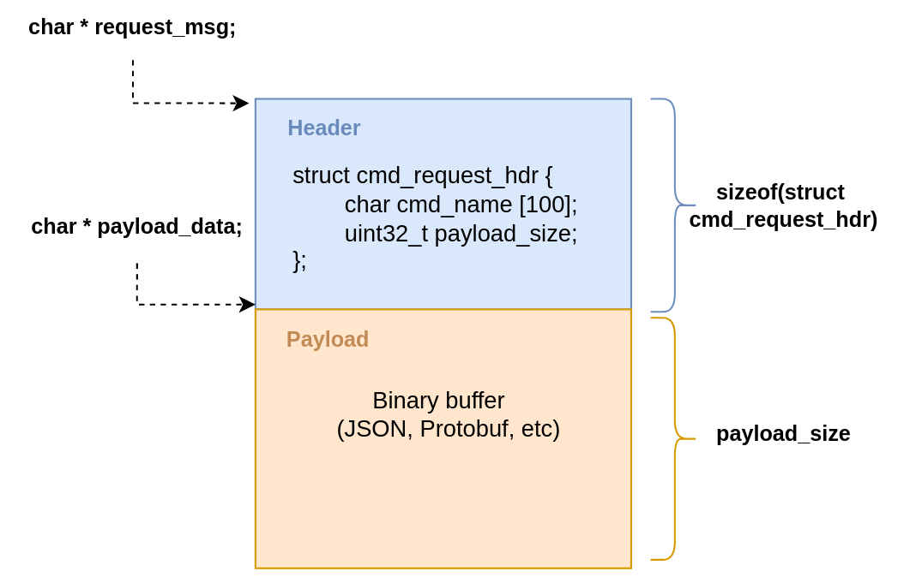

***********************************************
Laboratorio 3: Desarrollo de proyectos en C/C++
***********************************************

Requisitos previos
==================
* Siga los requisitos previos de `Laboratorio 1 <../lab1/lab1.html>`_ para preparar el ambiente para este laboratorio.

Introducción
============

El objetivo de este laboratorio consiste en implementar un prototipo de ``eieDevice``, tal como se presentó en el problema de diseño del laboratorio 1. Recordando el bosquejo inicial del sistema:

Su equipo en ``eieLabs`` deberá implementar la funcionalidad básica para el procesamiento de comandos solicitados por ``eieManager`` en ``eieDevice``. Esto corresponde a los siguientes componentes sugeridos en el laboratorio 1: ``TransportServer`` y ``CommandManager``.

Su equipo decidió que ``eieDevice`` será implementado utilizando C. Se concluyó que este lenguaje permite tener un mejor control de la implementación para soportar una gran variedad de dispositivos, incluyendo algunos con recursos limitados de procesamiento y memoria. Además, se considera que esta decisión permitirá realizar optimizaciones de bajo nivel para lograr un alto rendimiento en el sistema.

Se decidió utilizar una arquitectura tipo `RPC <https://www.geeksforgeeks.org/remote-procedure-call-rpc-in-operating-system/>`_ para enviar las solicitudes de comandos desde ``eieManager`` hasta las instancias de ``eieDevice``. Para implementar este mecanismo de comunicación se utilizará la biblioteca de mensajería `ZeroMQ <https://zeromq.org/>`_ para C, también llamada `CZMQ (high-level API) <http://czmq.zeromq.org/>`_. Puede referirse al manual `The ZeroMQ Guide <https://zguide.zeromq.org/>`_ así como a los ejemplos del curso en ``examples/c/zmq_demo`` y ``examples/python/zmq_demo``.

Una instancia de ``eieDevice`` puede verse como un programa que corre un servidor de ``ZMQ`` (socket ``ZMQ_REP``), que responde a solicitudes de un cliente (socket ``ZMQ_REQ``). En este diseño, se visualiza que ``eieManager`` va a tener un cliente de ``ZMQ`` en cada instancia de ``Device``.

Para encapsular los detalles del servidor de ``ZMQ``, ``eieDevice`` deberá implementar un componente llamado ``TransportServer``. Este nombre hace referencia a una capa de transporte de mensajes, que en este caso se implementa con sockets de ``ZMQ``.

Cuando se reciben las solicitudes en el ``TransportServer``, este invoca a otro componente, llamado ``CommandManager``, el cual está encargado de ejecutar el comando. Una vez se ejecuta el comando se debe retornar la respuesta al cliente del RPC. Note que tanto la información de la solicitud del comando como la respuesta se debe representar como un buffer genérico de bytes (arreglo). En estos buffers se debe codificar la información utilizando un formato de mensaje que consiste en las secciones de ``header`` y ``payload``. A continuación, se muestra dicho formato:

* Note que el ``header`` del mensaje consiste en una estructura que contiene la información que identifica el comando. En este caso sólamente se ocupa el nombre y el tamaño del ``payload``.

* Por otra parte, el ``payload`` del mensaje debe ser un buffer de bytes (tipo char), genérico desde el punto de vista del ``TransportServer``. Esto permitiría reutilizar dicho componente en diversas aplicaciones independientemente del formato del ``payload``. Sin embargo, para este caso el ``payload`` debe representar los argumentos del comando con el formato ``JSON``. Para esto se debe procesar el payload (`decoding`) utilizando la biblioteca `cJSON <https://github.com/DaveGamble/cJSON>`_. Para un ejemplo del uso de esta biblioteca refiérase a ``examples/c/sensor_commands`` en el repositorio del curso.

Los argumentos del comando se pueden representar en el formato ``JSON`` de la siguiente forma:

.. code-block:: json

    {
        "arg1": "value1",
        "arg2": "value2",
        "argN": "valueN"
    }

La respuesta del comando también se debe codificar (`encoding`) en un buffer de bytes utilizando ``cJSON`` . El ``CommandManager`` debe retornar este buffer de respuesta al ``TransportServer``, el cual se lo entrega el cliente mediante el socket de ``ZMQ``. El contenido de este ``JSON`` de respuesta queda a discreción, lo importante es demostrar el flujo de respuesta desde el comando hasta el cliente del ``RPC``.

A continuación, se muestra un diagrama de secuencia del flujo de ejecución de comandos en ``eieDevice``:

.. uml::

   @startuml

   actor TransportClient as tpc
   entity TransportServer as tps
   entity CommandManager as cmgr
   entity Command as cmd
   entity cJSON as cjson

   tpc -> tps: Send command request message to device
   group eieDevice command processing
   tps -> tps: Parse command name from \nrequest header
   tps -> cmgr: Execute command with name \nand request payload buffer
   cmgr -> cmgr: Find command in hash table registry
   cmgr -> cmd: Execute command function with \nrequest payload buffer
   cmd -> cjson: Parse JSON from request payload
   cmd <-- cjson
   cmd -> cmd: Run command business logic
   cmd -> cjson: Write response to buffer with cJSON
   cmd <-- cjson
   cmgr <- cmd: Return response buffer from command
   tps <- cmgr: Return response buffer from manager
   end
   tpc <- tps: Return response buffer to socket

   @enduml

El ``CommandManager`` debe tener un registro con todos los comandos disponibles, los cuales se deben poder obtener a partir de su nombre. Para esto se puede utilizar una `tabla hash`, la cual se puede basar en la biblioteca ``uthash`` tal como en el ejemplo de ``examples/c/sensor_commands`` (ver ``SensorManager`` y ``SensorFactory``). Estos comandos se deben registrar en el CommandManager al inicializarse el programa. Las operaciones que debe realizar ``CommandManager`` son:

* Registrar un comando con un nombre único.
* Desregistrar un comando a partir de su nombre.
* Ejecutar un comando a partir de su nombre.

Para cada una de estas operaciones defina al menos una función pública en el header ``command_manager.h``.

Para efectos de registrar los comandos puede generar arreglos globales de estructuras con la información que representa a cada comando. Al iniciar la aplicación de ``eie_device_server``, puede iterar por estos arreglos para registrar los comandos con las funciones de ``command_manager.h``. Una vez más, refiérase al ejemplo de ``examples/c/sensor_commands`` para un caso de uso de esta técnica (ver ``SensorFactory``). Una posible estructura para la información de un comando puede ser similar a la siguiente:

.. code-block:: c

   struct command_info {
      const char *name;
      void *priv;
      void (*command_fn)(const char *name, void *priv, const char *req_msg, char *resp_msg);
   };

Al ejecutarse el comando, el puntero ``command_fn`` es utilizado para ejecutar la lógica del mismo. Este debe recibir el nombre y los datos privados del propio comando.
Note que el ``TransportServer`` debe extraer el nombre del comando del ``header`` del mensaje de solicitud, para así poder solicitar su ejecución en el ``CommandManager``.

Instrucciones
=============
A continuación se describirán las instrucciones de los apartados de este laboratorio.

Construcción
------------

* Cree una jerarquía de scripts de CMake (``CMakeLists.txt``) para la construcción del proyecto. Una vez más se sugiere basarse en el ejemplo de ``examples/c/sensor_commands``. Note que además de ``cJSON`` debe agregar la dependencia de ``ZeroMQ`` para poder utilizar esta biblioteca.

* El CMake debe construir una biblioteca dinámica llamada ``eie_device`` (``libeie_device.so``) que contenga los símbolos de los componentes ``TransportServer`` y ``CommandManager``.

* El CMake también debe construir la aplicación llamada ``eie_device_server``, la cual utiliza la biblioteca antes mencionada para implementar el servidor de comandos.

* La instalación de cmake (``make install``) debe contener al menos lo siguiente:

  * Los archivos binarios de la biblioteca y la aplicación.
  * Los headers (.h) de la biblioteca para que otro programa pueda utilizarla.
  * El archivo pkg-config (.pc) para definir el paquete con su respectivo número de versión.

Implementación
--------------

* Implemente el componente ``TransportServer`` de la biblioteca ``eie_device``, tal como se indicó en la introducción. Para esto cree un socket ``ZMQ_REP``, así como un thread utilizando la biblioteca ``pthread`` para recibir los mensajes del socket en un loop continuo.

* Implemente el componente ``CommandManager`` de la biblioteca ``eie_device``, tal como se indicó en la introducción. Las funciones de este pueden llamarse desde el ``TransportServer``, con el objetivo de procesar el mensaje de solicitud del comando y generar una respuesta válida de vuelta al socket.

* Implemente la aplicación ``eie_device_server`` para responder a solicitudes de comandos utilizando los componentes de la bibliteca ``eie_device``. Para ejercitar el servidor puede utilizar un cliente basado en Python con el paquete `pyzmq <https://pypi.org/project/pyzmq>`_ y codificar los mensajes con los paquetes de `struct <https://docs.python.org/3/library/struct.html>`_ (request ``header``) y `json <https://docs.python.org/3/library/json.html>`_ (request ``payload`` y response). Refiérase a ``examples/python/zmq_demo`` para un ejemplo de codificar una estructura compatible con C utilizando el paquete ``struct`` en Python.

* Implemente y verifique un par de comandos para demostrar el funcionamiento del sistema:

  * El comando ``message`` no recibe ningún parámetro y retorna un string con nombre "output" y con un mensaje arbitrario utilizando ``JSON``.
  * El comando ``ping_pong`` recibe una lista arbitraria de argumentos (con el formato indicado en la introducción) y retorna un ``JSON`` con la misma lista.

* Para la prueba del servidor debe implementar y registrar algunos comandos de ejemplo.

Calidad del código
------------------

* Documente todas las clases y funciones del prototipo siguendo el formato de ``doxygen``. Refiérase una vez más al ejemplo de ``examples/c/sensor_commands``.

Evaluación
==========
Este laboratorio se realizará preferiblemente en grupos de 2 o 3 personas.

Rúbrica
-------

+---------------------------+------------------------------------------------------------------+------------+
| Apartado                  |  Criterios de evaluación                                         | Porcentaje |
+===========================+==================================================================+============+
| Construcción              || Implementar los scripts de CMake necesarios para construir      | 20%        |
|                           || la biblioteca, la aplicación y la instalación del proyecto.     |            |
|                           || Se crea un paquete de pkg-config que se puede integrar en       |            |
|                           || otro proyecto.                                                  |            |
+---------------------------+------------------------------------------------------------------+------------+
| Implementación del        || Lograr implementar la funcionalidad del ``TransportServer``     | 25%        |
| transport de RPC          || utilizando ZMQ y pthreads. Este componente debe ser capaz de    |            |
|                           || recibir mensajes y entregar respuestas de vuelta al cliente     |            |
|                           || del socket REP.                                                 |            |
+---------------------------+------------------------------------------------------------------+------------+
|| Implementación de los    || Lograr implementar la lógica genérica para administrar los      | 25%        |
|| comandos                 || comandos del dispositivo. Cada comando debe ser identificable   |            |
||                          || mediante su nombre, una función, y sus datos privados. Estos    |            |
||                          || deben registrarse en una tabla hash en el ``CommandManager``.   |            |
+---------------------------+------------------------------------------------------------------+------------+
|| Manejo de datos en los   || Los comandos deben recibir un buffer de solicitud con el        | 20%        |
|| comandos                 || formato indicado en la introducción, y deben poder devolver un  |            |
||                          || buffer de respuesta. Ambos buffers deben utilizar ``cJSON``     |            |
||                          || para codificar la información. Esto se demuestra con el         |            |
||                          || correcto funcionamiento de los comandos ``message`` y           |            |
||                          || ``ping_pong``.                                                  |            |
+---------------------------+------------------------------------------------------------------+------------+
| Calidad del código        || Las definiciones de los headers deben estar documentados        | 10%        |
|                           || utilizando el formato de Doxygen.                               |            |
+---------------------------+------------------------------------------------------------------+------------+

Revisión
--------

* Se debe demostrar con base en los autores de los commits de Git que todos los miembros del grupo trabajaron colaborativamente en el laboratorio utilizando control de versiones. De no ser así, no se asignará puntaje a los miembros que no contribuyeron (a menos que se justifique una excepción).
* Se utilizará la fecha del último commit de `merge` de un Pull Request (PR) de GitHub que modifique la documentación del laboratorio respectivo para determinar si la entrega se realizó a tiempo.
* Si se realizan entregas tardías, se rebajará 10% más por cada día extra (-10% primer día, -20% segundo día, etc).
* Para los grupos, sólo es necesario subir los cambios en el repositorio de uno de los miembros. Los demás miembros pueden hacer referencia a dicho repositorio y/o sincronizar los cambios en sus repositorios correspondientes.
* Se deberá facilitar un video de máximo 5 minutos en donde se muestre la funcionalidad del laboratorio según la rúbrica de la sección anterior.
