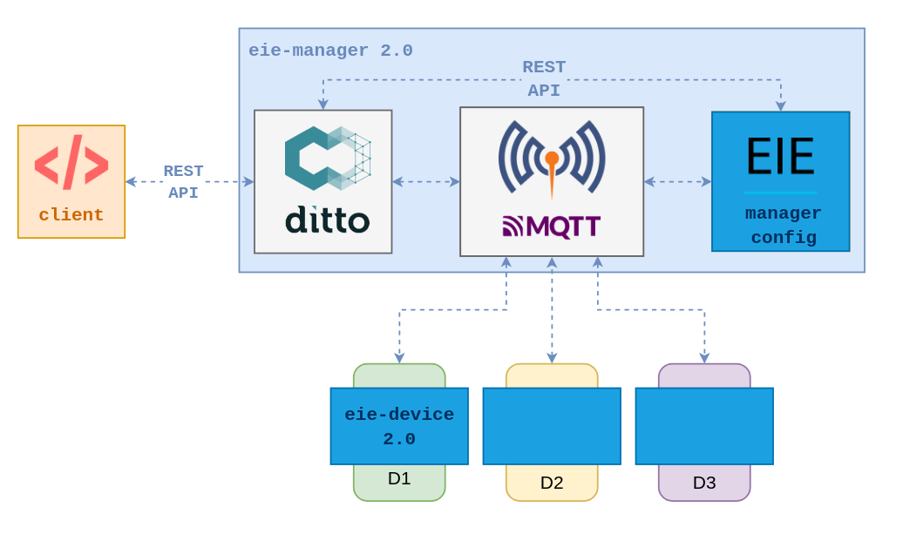

******************************
Proyecto Final: EieManager 2.0
******************************

Requisitos previos
==================
* Siga los requisitos previos de `Laboratorio 1 <../lab1/lab1.html>`_ para preparar el ambiente para este proyecto.

Introducción
============

Las acciones de su start-up `eieLabs` están creciendo como la espuma! Los inversionistas y el mercado han visto un gran potencial en plataformas completas de IoT como ``eieManager`` para administrar una gran variedad de dispositivos en un ambiente industrial (``IIoT``).

.. image:: img/factory_iot.png
   :align: center

En una reunión con los ejecutivos de la empresa, Usted, como arquitecto de ``eieManager``, comunica que a pesar de este gran potencial existen problemas en la solución actual a nivel de requerimientos funcionales, así como atributos de calidad como mantenibilidad, seguridad y escalabilidad:

* Los ``RPCs`` no se ajustan bien a la necesidad de comunicar eventos de manera `asincrónica` desde los dispositivos. Este tipo de comunicación puede ser muy útil para notificar condiciones de alarma o cambios en el estado del dispositivo sin que el sistema lo tenga que solicitar. Además, los eventos podrían dar un gran valor al sistema al facilitar la integración con otras aplicaciones de análisis de datos.

* Esta arquitectura no incluye el concepto de niveles de autorización para el acceso a grupos de dispositivos. Esto es fundamental para lograr una operación segura en una fábrica, en la cual el acceso a los dispositivos debe ser autenticado y restringido.

* Los clientes han manifestado que el mantenimiento del sistema es complejo, ya que un operador debe registrar manualmente cada nuevo dispositivo que se instale en la fábrica, ya sea mediante el archivo de configuración ``JSON`` o con el ``REST API``. Esto es especialmente problemático en despliegues con cientos de dispositivos.

A partir de esta reunión, los ejecutivos aprueban el presupuesto para que su departamento de ``R&D`` desarrolle un prototipo de ``eieManager 2.0``, tal que incorpore los aprendizajes del primer prototipo de ``eieManager`` y que se diseñe una nueva arquitectura que permita cubrir despliegues de gran escala, y así expandir el negocio (la ambición de los ejecutivos no tiene límites).

`Manos a la obra!`

Investigación inicial
=====================

Al investigar sobre protocolos de comunicación para la nueva arquitectura, Usted identifica que `MQTT <https://mqtt.org/>`_ puede cubrir la necesidad de comunicar eventos de manera eficiente, mediante el patrón ``publish/subscribe``. Además, este protocolo es liviano y se adapta a dispositivos de bajos recursos a nivel de CPU y memoria. Para incorporar ``MQTT`` en la solución, se determinó que el broker `Eclipse Mosquitto <https://mosquitto.org/>`_ cumple con la funcionalidad y condiciones legales para utilizarlo en esta aplicación comercial (licencia `EPL 2.0 <https://www.eclipse.org/legal/epl-2.0/>`_).

Por otra parte, se determinó que el concepto de `digital twin <https://www.ibm.com/topics/what-is-a-digital-twin>`_ puede ser muy útil para diseñar los modelos virtuales de los dispositivos de la fábrica. Con este concepto, relacionado al patrón de ``Proxy``, es posible emplear soluciones conocidas al problema de mantener representaciones virtuales precisas de objetos. Estas representaciones pueden ser utilizadas para analizar el estado del sistema sin tener que acceder directamente a los dispositivos reales.

Al explorar soluciones relacionadas con `digital twins`, se encontró el framework open-source `Eclipse Ditto <https://www.eclipse.org/ditto/intro-overview.html>`_, el cual provee un sistema genérico para implementar `digital twins` de manera escalable. Al igual que ``Mosquitto``, ``Ditto`` utiliza la licencia ``EPL 2.0``, por lo que se podría integrar fácilmente en la nueva solución.

Dentro de las características de ``Ditto`` que resultan atractivas para integrarlo en ``eieManager 2.0``, se encuentran:

* Implementa un `REST API <https://www.eclipse.org/ditto/httpapi-overview.html>`_ y un protocolo genérico (`Ditto protocol <https://www.eclipse.org/ditto/protocol-overview.html>`_) para administrar los dispositivos y abstraer el hardware mediante el concepto de `Thing <https://www.eclipse.org/ditto/basic-thing.html>`_.
* Se puede integrar con una amplia variedad de protocolos de transporte tales como ``MQTT``, ``AMQP``, ``HTTP``, ``Apache Kafka``, etc. Para más detalles, refiérase a `Connections <https://www.eclipse.org/ditto/basic-connections.html>`_.
* Permite establecer políticas de seguridad para el acceso a los dispositivos, de manera que se validen las solicitudes para garantizar que solo los sistemas autorizados puedan modificar y leer el estado de ciertos dispositivos. Para más detalles, refiérase a `Policy <https://www.eclipse.org/ditto/basic-policy.html>`_.
* Al emplear una `arquitectura basada en microservicios <https://www.eclipse.org/ditto/architecture-overview.html>`_, el sistema se encuentra distribuido en diferentes procesos, lo cual puede ayudar a que la aplicación sea más escalable, soportando cientos o miles de dispositivos y  a su vez permitiendo una alta disponibilidad y resistencia a fallos.

Sin embargo, tal como lo indica la documentación, ``Ditto`` no es una plataforma completa de ``IoT`` ni pretende serlo. Por ejemplo:

* No implementa un frontend o servicio que configure los dispositivos y políticas de acceso. Es necesario emplear uno o más componentes externos que hagan esto mediante el ``REST API``.
* No establece un protocolo de comunicación para la interacción con los dispositivos.
* La lógica para el procesamiento de mensajes y sincronización de estado entre el dispositivo real y su `digital twin` se deja como responsabilidad de la aplicación.

Arquitectura propuesta
======================

Según los requerimientos y objetivos de negocio, para la nueva arquitectura de ``eieManager 2.0``, se propone integrar ``Eclipse Ditto`` con ``Eclipse Mosquitto`` para la comunicación con los dispositivos mediante ``MQTT``. El siguiente diagrama muesta esta arquitectura.

.. note::

    Los nuevos componentes a implementar en el proyecto se representan en color azul.

.. note::

    El cliente es un servicio externo al sistema tal como un `frontend web` o `app móvil` para interactuar con los dispositivos. Esto está fuera del `scope` del proyecto.

A continuación, se describen los nuevos componentes a implementar:

* ``eie-device`` (2.0): Una biblioteca en C para facilitar la integración de los dispositivos con el sistema. Se busca que la biblioteca abstraiga los detalles del ``Ditto protocol`` y del cliente de ``MQTT``, tal que la aplicación se enfoque en representar la funcionalidad del dispositivo.

  * Se debe soportar una estructura de ``Thing`` como la que se muestra en `Mapping Vorto function block elements <https://www.eclipse.org/ditto/basic-feature.html#mapping-vorto-function-block-elements>`_, la cual representa `features` con propiedades estándar de `configuration` y `status`.
  * Se debe soportar la recepción de mensajes de ``Ditto`` para actualizar el dispositivo real mediante ``MQTT``. Para este prototipo se deben soportar `callbacks` para atender los eventos que se generan al modificar la propiedad `configuration` (`read-write`) en un feature del ``Twin``, por ejemplo desde el ``REST API``. Para más detalles, refiérase a `Create or modify a single Property of a Feature (Event) <https://www.eclipse.org/ditto/protocol-specification-things-create-or-modify.html#event-10>`_.
  * Se debe soportar el envío de mensajes a ``Ditto`` para actualizar el ``Twin`` del dispositivo mediante ``MQTT``. Para este prototipo se debe soportar la publicación de comandos que actualizan la propiedad `status` (`read-only`) en un feature del ``Twin``. Para más detalles, refiérase a `Create or modify a single Property of a Feature (Command) <https://www.eclipse.org/ditto/protocol-specification-things-create-or-modify.html#command-10>`_.
  * Se debe implementar el feature de `Device Discovery`, tal como se describe en la sección respectiva.

* ``eie-manager-config``: Un microservicio en Python para facilitar la configuración y el despliegue del sistema (mantenibilidad). Esto incluye configurar políticas, las conexiones de MQTT, y los dispositivos en ``Ditto``.

  * Se deben configurar las políticas de acceso y las conexiones de `source` y `target` al broker de ``MQTT``. Estas configuraciones se pueden obtener de archivos de configuración de ``JSON``, y luego registrarlas con el ``REST API`` de ``Ditto``.
  * Se debe implementar el feature de `Device Discovery`, tal como se describe en la sección respectiva.

.. note::

   El ``eie-device`` es considerado el componente más crítico por implementar en el nuevo prototipo, por lo que se debe priorizar adecuadamente. En particular, la funcionalidad más importante es la de facilitar la recepción y envío de mensajes de ``Ditto`` para actualizar las propiedades del `twin` y del hardware.

Device Discovery
----------------
Este feature busca facilitar el mantenimiento del sistema al permitir que los dispositivos se descubran automáticamente al publicar su configuración a ``eie-manager-config``. Este microservicio utiliza esta información para generar un identificador único para el dispositivo y para registrarlo en la instancia ``Ditto``.

Se sugiere implementar una secuencia tipo `handshake` para comunicar a ``eie-device`` con ``eie-manager-config``. Para esto, se utilizarán un mismo par de topics de ``MQTT`` para todos los dispositivos. Se sugieren los nombres de ``eie-manager/config/device_discovery/request`` y ``eie-manager/config/device_discovery/response``.

* Secuencia del `handshake` para ``eie-device``:

  #. Al inicializar el dispositivo (device init API), se recibe el nombre de un archivo ``JSON`` con la configuración del mismo. Esta consiste en la estructura del `Thing <https://www.eclipse.org/ditto/basic-thing.html>`_ y un string de `namespace` que represente el tipo de device.
  #. Suscribirse al topic ``eie-manager/config/device_discovery/response``.
  #. Publicar el mensaje ``JSON`` con la configuración del dispositivo en el topic ``eie-manager/config/device_discovery/request``. Como parte de este mensaje, se debe generar y enviar un número aleatorio llamado ``correlation-id``, que permita correlacionar la solicitud y la respuesta.
  #. Esperar por la respuesta del mensaje con el mismo ``correlation-id``. Si la misma no se recibe luego de un período de `timeout`, se puede volver a enviar el mismo mensaje con otro ``correlation-id``.
  #. Al recibir el mensaje de respuesta correspondiente, se extrae y guarda el identificador del dispositivo generado por `eie-manager-config`, llamado ``Thing ID``.

* Secuencia del `handshake` para ``eie-manager-config``:

  #. Suscribirse al topic ``eie-manager/config/device_discovery/request``, para poder recibir solicitudes desde los dispositivos. Nóte que esto se debe hacer una sola vez al iniciar el servicio.
  #. Al recibir un mensaje de solicitud desde un dispositivo:

     #. Generar un identificador único tipo string (``Thing ID``) a partir del `namespace` indicado. Para esto puede utilizar un número secuencial (ej: ``temp_sensor:5``). Debe almacenar estos identificadores o la secuencia en alguna estructura de datos para no repetirlos en el futuro.
     #. Registrar el nuevo ``Thing`` con el ``REST API`` de ``Ditto``.
     #. Una vez registrado exitosamente, publicar el mensaje de respuesta para el dispositivo en el topic ``eie-manager/config/device_discovery/response``, utilizando el mismo ``correlation-id`` del mensaje de solicitud.

.. note::

   Este feature es importante como un diferenciador de producto para la solución final. Sin embargo, no se considera la funcionalidad de mayor prioridad en el prototipo. Además, es posible utilizar temporalmente el ``REST API`` de forma manual para registrar los dispositivos y así poder desarrollar la lógica de recepción y envío de mensajes de ``Ditto`` de ``eie-device``.

Instrucciones
=============
A continuación se describirán las instrucciones de los apartados de este proyecto.

Planeamiento
------------

* Utilice la herramienta web `taiga.io <https://www.taiga.io/>`_ para el planeamiento Agile de su proyecto. Asegúrese de que cada miembros de su equipo tenga una cuenta y cree el proyecto tal que todos los miembros puedan tener acceso al mismo.
* En una o más reuniones de `planning`:

  #. Defina los `Epics` del proyecto. Se sugiere organizar los `Epics` en función de los diferentes componentes de la arquitectura.
  #. Cree los `User Stories` iniciales para cada `Epic`. Recuerde nombrarlos desde el punto de vista del usuario (sin detalles de implementación) y describirlos apropiadamente. Cada `User Story` debe tener un `criterio de aceptación` bien definido y una granularidad tal que al completarla se logre cierto objetivo de funcionalidad.
  #. Para cada `User Story`, defina `Tasks` específicos que permitan completarla. Estos `Tasks` sí pueden referirse a detalles de implementación.
  #. Distribuya los `User Stories` y sus `Tasks` según cierto orden de prioridad entre los miembros del equipo y asígnelos a `Sprints`.

.. tip::

   El éxito de su equipo se puede medir por los `User Stories` que son realmente completados en un `Sprint`. Completar sólamente algunos `Tasks` de cierto `User Story` no permite lograr el objetivo de funcionalidad definido, por lo que tiene poco valor desde el punto de vista del usuario.

.. note::

   * Este planeamiento es súmamente importante para la evaluación del proyecto. Se deben planificar los `Sprints` de manera que se logren completar primero los `User Stories` de mayor prioridad, de principio a fin.
   * Al final del proyecto, es posible justificar no haber completado ciertos `User Stories` haciendo un análisis de prioridad, incertidumbre y del triángulo de `Scope`, `Recursos` y `Tiempo`. En ese caso, se debe justificar como la estrategia del `planning` permitió completar los `User Stories` de mayor prioridad y cual sería el plan de `Release` para los que no se pudieron completar en los `Sprints` definidos inicialmente.

Documentación
-------------

La documentación del proyecto debe ser publicada en una página de `Read The Docs`, tal como se hizo en los laboratorios.

Justificación
+++++++++++++

Justifique como la nueva arquitectura propuesta para ``EieManager 2.0`` permite lograr los objetivos de negocio, así como solucionar los retos y problemas de la introducción. Para esto puede parafrasear parte de las secciones de la `Introducción`. Mencione como los componentes de esta arquitectura permiten cumplir con al menos un par de atributos de calidad, haciendo referencia a tácticas y patrones de diseño. Por ejemplo, se sugiere referirse al patrón de `Broker`.

Requerimientos
++++++++++++++

Según el apartado `5.3 Specific Requirements` del estándar `IEEE Recommended Practice for Software Requirements Specifications (Std 830-1998) <https://mv1.mediacionvirtual.ucr.ac.cr/mod/resource/view.php?id=1613826>`_:

* Especifique una lista de al menos 4 requerimientos funcionales para ``eie-device``.
* Especifique una lista de al menos 3 requerimientos funcionales para ``eie-manager-config``.

.. note::
  Asegúrese de utilizar identificadores numéricos para todos los requerimientos (ej, ``REQ-XYZ``).

Diseño de API
+++++++++++++

* Para ``eie-device``, documente una lista de funciones que implementen el ``API`` de la biblioteca. Esta lista debe contener el nombre de cada función y una descripción de sus responsabilidades, las cuales deben estar orientadas a cubrir los requerimientos funcionales definidos previamente.

.. note::

  El objetivo de este apartado es facilitar el diseño de la biblioteca y hacer un bosquejo para su header (``eie_device.h``).

Diagramas
+++++++++

Implemente los diagramas de secuencia sobre los siguientes escenarios de uso del sistema. Debe mostrar el detalle de cómo interactúan los diferentes componentes.

  #. El ``client`` modifica la propiedad ``configuration`` en un feature del `twin` de un dispositivo. Recuerde que esto genera un evento que ``Ditto`` notifica al dispositivo real mediante ``MQTT`` para que se actualice el estado del hardware. Debe mostrar toda la secuencia de comunicación desde el ``client`` hasta el ``eie-device`` (pasando por ``Ditto`` y el ``MQTT broker``).
  #. El ``eie-device`` actualiza la propiedad ``status`` en un feature de su `twin` correspondiente publicando a un topic de ``MQTT``. Debe mostrar toda la secuencia de comunicación desde ``eie-device`` hasta ``Ditto`` (pasando por el ``MQTT broker``).
  #. El ``eie-device`` publica su configuración inicial y es registrado por ``eie-manager-config`` en ``Ditto``. Debe mostrar toda las secuencia de comunicación desde ``eie-device`` hasta ``Ditto`` (pasando por ``eie-manager-config``).

Implementación
--------------
Tal como se mencionó en la arquitectura propuesta, para completar la solución de ``EieManager 2.0`` se deben implementar dos componentes nuevos.

eie-device
++++++++++++++

* Para implementar esta biblioteca se utilizará un proyecto de CMake. Se propone emplear el cliente de `Paho MQTT C <https://www.eclipse.org/paho/index.php?page=clients/c/index.php>`_ (`paho.mqtt.c repo <https://github.com/eclipse/paho.mqtt.c>`_, `paho.mqtt.c docs <https://www.eclipse.org/paho/files/mqttdoc/MQTTClient/html/index.html>`_), con ``MQTT 3.1``, para la comunicación con ``Mosquitto``. Para el procesamiento de los mensajes del `Ditto protocol`, se sugiere utilizar ``cJSON``.

* Cree una jerarquía de scripts de CMake (``CMakeLists.txt``) para la construcción de la biblioteca. Se sugiere basarse en el laboratorio 3 y el ejemplo de ``examples/c/sensor_commands``. Tal como se indicó previamente, como dependencias se sugiere integrar ``paho.mqtt.c`` y ``cJSON``.

* El CMake debe construir una biblioteca dinámica llamada ``eie_device`` (``libeie_device.so``), así como aplicaciones de ejemplo de dispositivos que utilicen la biblioteca para el demo.

* La instalación de cmake (``make install``) debe contener al menos lo siguiente:

  * Los archivos binarios de la biblioteca y las aplicaciones de ejemplo.
  * Los headers (.h) de la biblioteca para que otro programa pueda utilizarla.
  * El archivo pkg-config (.pc) para definir el paquete con su respectivo número de versión (2.0).

* Implemente la funcionalidad de la biblioteca, según los requerimientos y la documentación del diseño. La separación de esta biblioteca en subcomponentes internos se deja a discreción. Sin embargo, es importante implementarla de manera que se facilite su `testabilidad`.

* Documente todas las funciones y tipos (estructuras, enums, etc) de la biblioteca siguendo el formato de ``doxygen``. Refiérase una vez más al ejemplo de ``examples/c/sensor_commands``.

.. tip::

   Para la lógica de registrar ``callbacks`` para el procesamiento de mensajes provenientes de ``Ditto`` se sugiere utilizar una tabla hash, de forma similar a la estrategia utilizada en el ejemplo de ``examples/c/sensor_commands`` y el ``CommandManager`` del laboratorio 3.

.. note::

   Es fundamental que esta biblioteca abstraiga completamente la interacción con el cliente de ``MQTT`` y los topics. La aplicación final debe interactuar sólamente con ``APIs`` de ``eie-device`` y objetos de ``cJSON``.

eie-manager-config
++++++++++++++++++

* Para implementar este microservicio puede crear un script de Python. Para la interacción con el broker de ``MQTT``, puede utilizar el paquete de `paho-mqtt <https://pypi.org/project/paho-mqtt/>`_.

* Implemente la funcionalidad del microservicio, según los requerimientos especificados en la documentación.

.. tip::

   Para un ejemplo sobre la configuración de políticas y conexiones de ``Ditto`` en una aplicación con ``MQTT``, puede referirse a `mqtt-bidirectional <https://github.com/eclipse/ditto-examples/blob/master/mqtt-bidirectional/README.md>`_. Sin embargo, no utilice los `mapping functions`, ya que estos son para casos de uso muy específicos y no se ajusta a la necesidad de implementar sistemas genéricos con ``eie-device``.

.. note::

   Por limitaciones de tiempo y recursos, en el prototipo de ``EieManager 2.0`` no se verificará este componente de manera rigurosa, por lo que no se implementará un ambiente de testing con ``pytest``. Nóte que antes de lanzar el sistema a producción será necesario implementar y automatizar estas pruebas.

Unit Testing
------------

* Planifique e implemente un suite de pruebas unitarias para ``eie-device`` con ``googletest``. Defina los tests para verificar los requerimientos funcionales básicos de la biblioteca, así como lógica de `sanity checks` de los ``APIs``. Para un ejemplo de `googletest`, refiérase a `examples/c/gtest_demo <https://github.com/ezamoraa/ie0417/tree/main/examples/c/gtest_demo>`_.

* Se sugiere utilizar otro cliente de ``MQTT`` directamente en los tests para probar parte de la funcionalidad de la biblioteca. Por ejemplo, este cliente se puede utilizar para simular la recepción de un mensaje proveniente de ``Ditto``, tal que se pueda ejercitar algún `callback` registrado.

* Asegúrese de documentar apropiadamente las funciones de los tests para que quede claro el objetivo de cada prueba.

.. tip::

   Utilice clases de ``fixture`` para la inicialización de la biblioteca y cualquier otra entidad requerida para el test, tal como otro cliente de ``MQTT``.

.. note::

   Debe levantar una instancia del broker de ``MQTT`` (``Eclipse Mosquitto``) antes de ejecutar los tests para poder interactuar con ``MQTT``. Para automatizar estas pruebas en el futuro, se puede asumir que la infrastructura de pruebas se encargará de esta inicialización del broker de ``MQTT``.

.. note::

   Esta suite de pruebas unitarias se considera crítica para la validación del prototipo del sistema.

Despliegue
----------

* El prototipo de ``EieManager 2.0`` debe desplegarse utilizando Docker. Para esto implemente un script de Docker compose (``docker-compose.yml``) que levante los siguientes contenedores desde imágenes provenientes de `Docker Hub <https://hub.docker.com/>`_:

  * Microservicios de ``Ditto``. Refiérase al `README de Ditto Docker <https://github.com/eclipse/ditto/tree/master/deployment/docker>`_ y al script de `Ditto docker-compose.yml <https://github.com/eclipse/ditto/blob/master/deployment/docker/docker-compose.yml>`_.
  * ``Eclipse Mosquitto``. Refiérase a la imagen de Docker Hub de `eclipse-mosquitto <https://hub.docker.com/_/eclipse-mosquitto>`_. Asegúrese de exponer el puerto de ``MQTT`` (default 8883) para que el broker se accesible desde sistemas externos (ej: las instancias de ``eie-device``).
  * ``eie-manager-config``. Debe implementar un ``Dockerfile`` y subir una imagen generada a `Docker Hub`.

.. note::

   Se recomienda implementar este script y verificar el funcionamiento del sistema con Docker lo antes posible. Esto facilitará el desarrollo del proyecto y le permitirá ahorrar tiempo para preparar la demostración.

Presentación
------------

* Se debe hacen una presentación en video en donde se muestre el despliegue de ``EieManager 2.0`` interactuando con al menos un par de dispositivos de ejemplo. Estos dispositivos se representan mediante programas de C que utilicen ``eie-device`` para demostrar el cumplimiento de los requerimientos.
* Se debe mostrar la ejecución exitosa de las pruebas unitarias para ``eie-device``.
* Se debe presentar la plataforma `Taiga` para mostrar el cumplimiento de los `User Stories` prioritarios. Se debe justificar la estrategia seguida y explicar cualquier decisión pertinente. Esta justificación es fundamental para considerar como exitoso el planeamiento y desarrollo del prototipo.

Evaluación
==========
Este proyecto se realizará preferiblemente en grupos de 2 o 3 personas.

Rúbrica
-------

+---------------------------+------------------------------------------------------------------+------------+
| Apartado                  |  Criterios de evaluación                                         | Porcentaje |
+===========================+==================================================================+============+
| Planeamiento              || Representar todo el `scope` del proyecto en `Taiga`.            | 10%        |
|                           || Definir apropiadamente los `Epics` y los `User Stories`.        |            |
+---------------------------+------------------------------------------------------------------+------------+
| Documentación             || Utilizar `Read The Docs` para publicar la documentación del     | 10%        |
|                           || proyecto. Incluir los apartados indicados en las instrucciones. |            |
+---------------------------+------------------------------------------------------------------+------------+
| Implementación            || Implementar los requerimientos funcionales definidos para       | 40%        |
|                           || ``eie-device`` y ``eie-manager-config``. Utilizar un proyecto   |            |
|                           || de CMake para `eie-device` con los apartados solicitados.       |            |
|                           || Abstraer el cliente de ``MQTT`` en `eie-device`.                |            |
|                           || Documentar las funciones y estructuras implementadas.           |            |
+---------------------------+------------------------------------------------------------------+------------+
| Unit Testing              || Emplear `googletest` para implementar un suite de tests         | 20%        |
|                           || unitarios para ``eie-device``. Verificar los requerimientos     |            |
|                           || funcionales de la biblioteca, así como los `sanity checks`.     |            |
|                           || Documentar con comentarios las funciones de los tests para      |            |
|                           || explicar el objetivo de cada prueba.                            |            |
+---------------------------+------------------------------------------------------------------+------------+
| Despliegue                || Utilizar `Docker Compose` para desplegar todos los contenedores | 10%        |
|                           || que comprenden el prototipo de ``EieManager 2.0``. Obtener      |            |
|                           || todas las imágenes de `Docker Hub`, incluyendo la de            |            |
|                           || `eie-manager-config`, la cual debe ser publicada.               |            |
+---------------------------+------------------------------------------------------------------+------------+
| Presentación              || Demostrar la funcionalidad del prototipo mediante dispositivos  | 10%        |
|                           || de ejemplo. Justificar las decisiones de planeamiento y         |            |
|                           || demostrar el cumplimiento de los `User Stories` prioritarios.   |            |
+---------------------------+------------------------------------------------------------------+------------+

Avances
-------
* `Avance Parcial 1`

  * El planeamiento completo del proyecto en la plataforma `Taiga`.
  * El apartado completo de documentación del proyecto.
  * El despliegue de contenedores del ``EieManager 2.0`` funcionando con un esqueleto de ``eie-manager-config``.

* `Avance Parcial 2`

  * Implementación parcial de ``eie-device`` y ``eie-manager-config``.
  * Unit testing parcial de ``eie-device``.

* `Entrega Final`

  * Implementación completa de ``eie-device`` y ``eie-manager-config``.
  * Unit testing completo de ``eie-device``.
  * Presentación del proyecto.

Revisión
--------

* Se debe demostrar con base en los autores de los commits de Git que todos los miembros del grupo trabajaron colaborativamente en cada avance utilizando control de versiones. De no ser así, no se asignará puntaje a los miembros que no contribuyeron (a menos que se justifique una excepción).
* Se utilizará la fecha del último commit de `merge` de un Pull Request (PR) de GitHub que modifique el proyecto para determinar si la entrega se realizó a tiempo.
* Para los grupos, sólo es necesario subir los cambios en el repositorio de uno de los miembros. Los demás miembros pueden hacer referencia a dicho repositorio y/o sincronizar los cambios en sus repositorios correspondientes.
