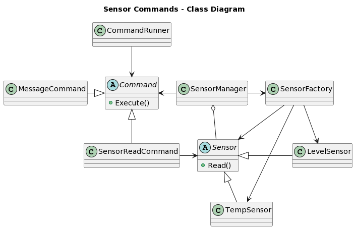
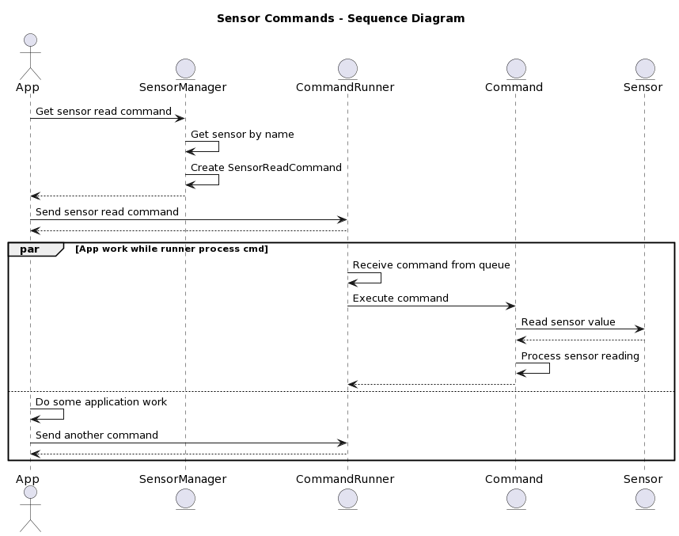

# Sensor Commands

Este ejemplo consiste en un sistema genérico de administración de sensores. El mismo demuestra el uso de múltiples patrones de diseño de software y conceptos de programación avanzada en C. Entre estos elementos se encuentran:

- Polimorfismo con punteros a funciones
- Encapsulamiento con funciones estáticas
- Programación orientada a objetos con estructuras
- Patrón de diseño de comandos
- Multithreading con pthreads
- Implementación de una tabla hash

## Pasos de construcción
Para instalar manualmente la dependencia de `cJSON`, puede ejecutar los siguiente pasos:

```console
$ git clone https://github.com/DaveGamble/cJSON.git
$ cd cJSON
$ mkdir build
$ cd build
$ cmake ..
$ make install
```

Desde el contenedor de desarrollo en el directorio base del ejemplo (`examples/c/sensor_commands/`) ejecute los siguiente comandos:

```console
$ mkdir build
$ cd build
$ cmake ..
$ make
```

## Diagrama de clases


## Diagrama de secuencia

